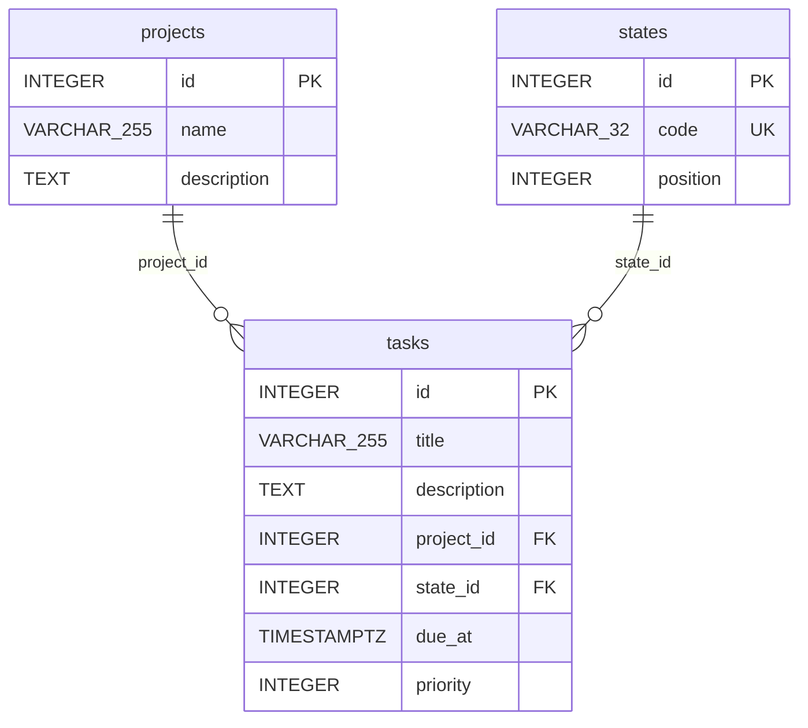

# Esquema de la base de datos

La forma de las tablas. El comportamiento observable de la API está en
[docs/contrato-api.md](contrato-api.md).

Generado a partir de `app/models.py` y `alembic/versions/`. El esquema se
construye por migraciones encadenadas, en este orden:
`b93548d24a12` (vacía) → `bfc6b3db4937` (`states`) → `da291a58134e`
(`projects`) → `8d5db4e9427b` (`tasks`) → `6e4d2e01536c` (`due_at`) →
`eb72bf268a89` (`priority`).

## Diagrama

## Diccionario de datos

### `states`

Catálogo cerrado de estados de tarea. Ver la sección
[Estados](contrato-api.md#estados) del contrato: qué códigos existen, por qué
llega por migración y no por script de Docker, y por qué el seed es
[idempotente](glosario.md#idempotente).

| Columna | Tipo | Nulos | Significado |
|---|---|---|---|
| `id` | `INTEGER` | no | Clave primaria. |
| `code` | `VARCHAR(32)` | no | Código del estado (`PENDIENTE`, `EN_CURSO`, `BLOQUEADA`, `HECHA`). |
| `position` | `INTEGER` | no | Campo de orden del catálogo; lo usa `GET /states` para ordenar (ver [Orden de las listas](contrato-api.md#orden-de-las-listas)). El seed lo asigna `1..4` en el orden en que el contrato declara los códigos. |

- `UNIQUE (code)` con nombre propio `uq_states_code` (`bfc6b3db4937`).
- El seed del catálogo depende de esa restricción: usa
  `INSERT ... ON CONFLICT (code) DO NOTHING`, que sin la `UNIQUE (code)` sería
  un error de SQL, no un no-op.

### `projects`

Sus filas las crea la API, no una migración. Sin seed.

| Columna | Tipo | Nulos | Significado |
|---|---|---|---|
| `id` | `INTEGER` | no | Clave primaria. |
| `name` | `VARCHAR(255)` | no | |
| `description` | `TEXT` | sí | |

### `tasks`

Sus filas las crea la API. `due_at` y `priority` se añaden en migraciones
posteriores a la de la tabla (`6e4d2e01536c` y `eb72bf268a89`).

| Columna | Tipo | Nulos | Significado |
|---|---|---|---|
| `id` | `INTEGER` | no | Clave primaria. |
| `title` | `VARCHAR(255)` | no | |
| `description` | `TEXT` | sí | |
| `project_id` | `INTEGER` | no | Proyecto al que pertenece la tarea. FK a `projects.id`. |
| `state_id` | `INTEGER` | no | Estado de la tarea. FK a `states.id`. |
| `due_at` | `TIMESTAMP WITH TIME ZONE` | sí | Fecha límite. La app la guarda ya normalizada a UTC; ver [Tareas v2: Fechas Límite](contrato-api.md#tareas-v2-fechas-límite). |
| `priority` | `INTEGER` | sí | Prioridad. Sin rango ni catálogo en la base; ver [Tareas: Prioridad](contrato-api.md#tareas-prioridad). |

- `FOREIGN KEY (project_id)` → `projects.id` y `FOREIGN KEY (state_id)` →
  `states.id`, ambas sin `ON DELETE`: PostgreSQL rechaza borrar un `project` o
  un `state` referenciado. El `409` de `DELETE /projects/{id}` con tareas lo
  aplica además la API (ver la sección
  [Proyectos](contrato-api.md#proyectos) del contrato).
- Restricciones con nombre autogenerado por PostgreSQL
  (`tasks_pkey`, `tasks_project_id_fkey`, `tasks_state_id_fkey`); ninguna
  migración les pasa un nombre explícito.
